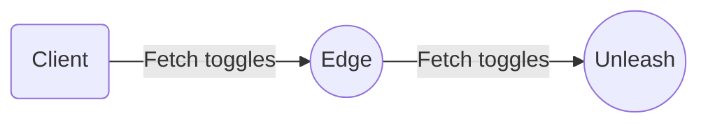
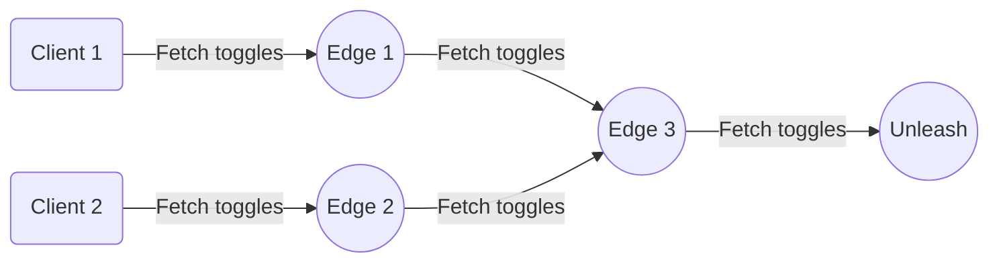
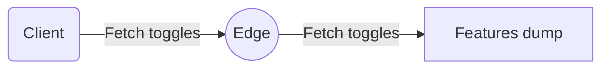

# Unleash Edge

[](https://crates.io/crates/unleash-edge)
[](https://docs.rs/unleash-edge/latest)

[](https://deps.rs/crate/unleash-edge/0.2.0)
[](https://github.com/Unleash/unleash-edge/actions/workflows/test-with-coverage.yaml)
[](https://coveralls.io/github/Unleash/unleash-edge?branch=main)


Unleash Edge is the successor to the [Unleash Proxy](https://docs.getunleash.io/how-to/how-to-run-the-unleash-proxy).

## Running Unleash Edge

Unleash Edge is compiled to a single binary. You can configure it by passing in arguments or setting environment variables.

```shell
Usage: unleash-edge [OPTIONS] <COMMAND>

Commands:
  edge     Run in edge mode
  offline  Run in offline mode
  help     Print this message or the help of the given subcommand(s)

Options:
  -p, --port <PORT>
          Which port should this server listen for HTTP traffic on [env: PORT=] [default: 3063]
  -i, --interface <INTERFACE>
          Which interfaces should this server listen for HTTP traffic on [env: INTERFACE=] [default: 0.0.0.0]
  -w, --workers <WORKERS>
          How many workers should be started to handle requests. Defaults to number of physical cpus [env: WORKERS=] [default: number of physical cpus]
      --tls-enable
          Should we bind TLS [env: TLS_ENABLE=]
      --tls-server-key <TLS_SERVER_KEY>
          Server key to use for TLS [env: TLS_SERVER_KEY=]
      --tls-server-cert <TLS_SERVER_CERT>
          Server Cert to use for TLS [env: TLS_SERVER_CERT=]
      --tls-server-port <TLS_SERVER_PORT>
          Port to listen for https connection on (will use the interfaces already defined) [env: TLS_SERVER_PORT=] [default: 3043]
      --instance-id <INSTANCE_ID>
          Instance id. Used for metrics reporting [env: INSTANCE_ID=] [default: Ulid::new()]
  -a, --app-name <APP_NAME>
          App name. Used for metrics reporting [env: APP_NAME=] [default: unleash-edge]
  -h, --help
          Print help
```

## Concepts

### Modes

Edge currently supports 2 different modes:

- [Edge](#edge) - Connection to upstream node (Unleash instance or another Edge). Supports dynamic tokens, metrics and other advanced features;
- [Offline](#offline) - No connection to upstream node. Full control of data and tokens;

#### Edge



Edge mode is the "standard" mode for Unleash Edge and the one you should default to in most cases. It connects to an upstream node, such as your Unleash instance, and uses that as the source of truth for feature toggles.

Other than connecting Edge directly to your Unleash instance, it's also possible to connect to another Edge instance (_daisy chaining_). You can have as many Edge nodes as you'd like between the Edge node your clients are accessing and the Unleash server, and it's also possible for multiple nodes to connect to a single upstream one. Depending on your architecture and requirements this can be a powerful feature, offering you flexibility and scalability when planning your implementation.



This means that, in order to start up, Edge mode needs to know where the upstream node is. This is done by passing the `--upstream-url` command line argument or setting the `UPSTREAM_URL` environment variable.

By default, Edge mode uses an in-memory cache to store the features it fetches from the upstream node. However, you may want to use a more persistent storage solution. For this purpose, Edge supports either Redis or a backup file, which you can configure by passing in either the `--redis-url` or `--backup_folder` command line argument, respectively. On start-up, Edge checks whether the persistent backup option is specified, in which case it uses it to populate its internal caches. This can be useful when your Unleash server is unreachable.

Edge mode also supports dynamic tokens, meaning that Edge doesn't need a token to be provided when starting up. Once we make a request to the `/api/client/features` endpoint using a [client token](https://docs.getunleash.io/reference/api-tokens-and-client-keys#client-tokens) Edge will validate upstream and fetch its respective features. After that, it gets added to the list of known tokens that gets periodically synced, making sure it is a valid token and its features are up-to-date.

Even though Edge supports dynamic tokens, you still have the option of providing a token through the command line argument or environment variable. This way, since Edge already knows about your token at start up, it will sync your features for that token and should be ready for your requests right away (_warm up / hot start_).

[Front-end tokens](https://docs.getunleash.io/reference/api-tokens-and-client-keys#front-end-tokens) can also be used with `/api/frontend` and `/api/proxy` endpoints, however they are not allowed to fetch features upstream. In order to use these tokens correctly and make sure they return the correct information, it's important that the features they are allowed to access are already present in that Edge node's features cache. The easiest way to ensure this is by passing in at least one client token as one of the command line arguments, ensuring it has access to the same features as the front-end token you'll be using.

Besides dynamic tokens, Edge mode also supports metrics and other advanced features.

To launch in this mode, run:

```bash
$ unleash-edge edge -h
Run in edge mode

Usage: unleash-edge edge [OPTIONS] --upstream-url <UPSTREAM_URL>

Options:
  -u, --upstream-url <UPSTREAM_URL>
          Where is your upstream URL. Remember, this is the URL to your instance, without any trailing /api suffix [env: UPSTREAM_URL=]
  -r, --redis-url <REDIS_URL>
         A URL pointing to a running Redis instance. Edge will use this instance to persist feature and token data and read this back after restart. Mutually exclusive with the --backup-folder option [env: REDIS_URL=]
  -b, --backup-folder <BACKUP_FOLDER>
          A path to a local folder. Edge will write feature and token data to disk in this folder and read this back after restart. Mutually exclusive with the --redis-url option  [env: BACKUP_FOLDER=]
  -m, --metrics-interval-seconds <METRICS_INTERVAL_SECONDS>
          How often should we post metrics upstream? [env: METRICS_INTERVAL_SECONDS=] [default: 60]
  -f, --features-refresh-interval-seconds <FEATURES_REFRESH_INTERVAL_SECONDS>
          How long between each refresh for a token [env: FEATURES_REFRESH_INTERVAL_SECONDS=] [default: 10]
  -t, --tokens <TOKENS>
          Get data for these client tokens at startup. Hot starts your feature cache [env: TOKENS=]
  -h, --help
          Print help

```

#### Offline



Offline mode should be used when you don't have a connection to an upstream node, such as your Unleash instance itself or another Edge instance. It can also be used when you need to have full control of both the data your clients will get and which tokens can be used to access it.

Since this mode does not connect to an upstream node, it needs a downloaded JSON dump of a result from a query against an Unleash server on the [/api/client/features](https://docs.getunleash.io/reference/api/unleash/get-client-feature) endpoint as well as a comma-separated list of tokens that should be allowed to access the server.

If your token follows the Unleash API token format `[project]:[environment].<somesecret>`, Edge will filter the features dump to match the project contained in the token.

If you'd rather use a simple token like `secret-123`, any query against `/api/client/features` will receive the dump passed in on the command line.

When using offline mode, you can think of these tokens as [proxy client keys](https://docs.getunleash.io/reference/api-tokens-and-client-keys#proxy-client-keys).

Since offline mode does not connect to an upstream node, it does not support metrics or dynamic tokens.

To launch in this mode, run:

```bash
$ ./unleash-edge offline --help
Usage: unleash-edge offline [OPTIONS]

Options:
  -b, --bootstrap-file <BOOTSTRAP_FILE>  [env: BOOTSTRAP_FILE=]
  -t, --tokens <TOKENS>                  [env: TOKENS=]
```

## Performance
Unleash edge will scale linearly with CPU. There are k6 benchmarks in the benchmark folder and we've already got some initial numbers from [hey](https://github.com/rakyll/hey).

Do note that the number of requests Edge can handle does depend on the total size of your toggle response. That is, Edge is faster if you only have 10 toggles with 1 strategy each, than it will be with 1000 toggles with multiple strategies on each. Benchmarks here were run with data fetched from the Unleash demo instance (roughly 100kB (350 features / 200 strategies)) as well as against a small dataset of 5 features with one strategy on each. 

Edge was started using
`docker run --cpus="<cpu>" --memory=128M -p 3063:3063 -e UPSTREAM_URL=<upstream> -e TOKENS="<client token>" unleashorg/unleash-edge:edge -w <number of cpus rounded up to closest integer> edge`

Then we run hey against the proxy endpoint, evaluating toggles


### Large Dataset (350 features (100kB))
```shell
$ hey -z 10s -H "Authorization: <frontend token>" http://localhost:3063/api/frontend`
```

| CPU | Memory | RPS | Endpoint | p95 | Data transferred | 
| --- | ------ | --- | -------- | --- | ---------------- |
| 0.1 | 6.7 Mi | 600 | /api/frontend | 103ms | 76Mi | 
| 1 | 6.7 Mi | 6900 | /api/frontend | 7.4ms | 866Mi |
| 4 | 9.5 | 25300 | /api/frontend | 2.4ms | 3.2Gi |
| 8 | 15 | 40921 | /api/frontend | 1.6ms | 5.26Gi |

and against our client features endpoint.

```shell
$ hey -z 10s -H "Authorization: <client token>" http://localhost:3063/api/client/features
```

| CPU | Memory observed | RPS | Endpoint | p95 | Data transferred |
| --- | ------ | --- | -------- | --- | ---------------- |
| 0.1 | 11 Mi | 309 | /api/client/features | 199ms | 300 Mi |
| 1 | 11 Mi | 3236 | /api/client/features | 16ms | 3 Gi |
| 4 | 11 Mi | 12815 | /api/client/features | 4.5ms | 14 Gi | 
| 8 | 17 Mi | 23207 | /api/client/features | 2.7ms | 26 Gi | 

### Small Dataset (5 features (2kB))

```shell
$ hey -z 10s -H "Authorization: <frontend token>" http://localhost:3063/api/frontend`
```

| CPU | Memory | RPS | Endpoint | p95 | Data transferred | 
| --- | ------ | --- | -------- | --- | ---------------- |
| 0.1 | 4.3 Mi | 3673 | /api/frontend | 93ms | 9Mi | 
| 1 | 6.7 Mi | 39000 | /api/frontend | 1.6ms | 80Mi |
| 4 | 6.9 Mi | 110000 | /api/frontend | 600μs | 252Mi |
| 8 | 12.5 Mi | 141090 | /api/frontend | 600μs | 324Mi |

and against our client features endpoint.

```shell
$ hey -z 10s -H "Authorization: <client token>" http://localhost:3063/api/client/features
```

| CPU | Memory observed | RPS | Endpoint | p95 | Data transferred |
| --- | ------ | --- | -------- | --- | ---------------- |
| 0.1 | 4 Mi | 3298 | /api/client/features | 92ms | 64 Mi |
| 1 | 4 Mi | 32360 | /api/client/features | 2ms | 527Mi |
| 4 | 11 Mi | 95838 | /api/client/features | 600μs | 2.13 Gi | 
| 8 | 17 Mi | 129381 | /api/client/features | 490μs | 2.87 Gi | 

## Development

See our [Contributors guide](./CONTRIBUTING.md) as well as our [development-guide](./development-guide.md)
