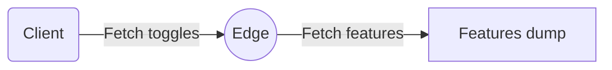
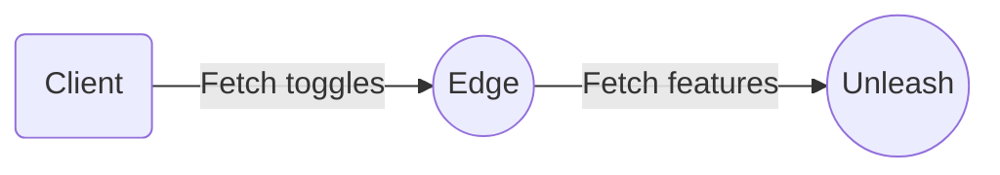
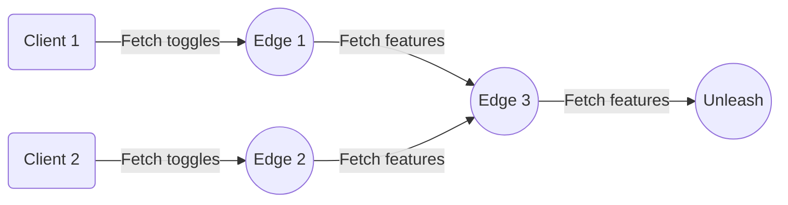

# Unleash Edge

Unleash Edge is the successor to the [Unleash Proxy](https://docs.getunleash.io/how-to/how-to-run-the-unleash-proxy).

## Running Unleash Edge

Unleash Edge is compiled to a single binary. You can configure it by passing in arguments or setting environment variables.

```shell
$ ./unleash-edge --help
Commands:
  offline  Run in offline mode
  edge     Run in edge mode
Options:
  -p, --port <PORT>
          Which port should this server listen for HTTP traffic on [env: PORT=] [default: 3063]
  -i, --interface <INTERFACE>
          Which interfaces should this server listen for HTTP traffic on [env: INTERFACE=] [default: 0.0.0.0]
      --tls-enable
          Should we bind TLS [env: TLS_ENABLE=]
      --tls-server-key <TLS_SERVER_KEY>
          Server key to use for TLS [env: TLS_SERVER_KEY=]
      --tls-server-cert <TLS_SERVER_CERT>
          Server Cert to use for TLS [env: TLS_SERVER_CERT=]
      --tls-server-port <TLS_SERVER_PORT>
          Port to listen for https connection on (will use the interfaces already defined) [env: TLS_SERVER_PORT=] [default: 3043]
```

## Concepts

### Modes

Edge supports various modes, from a local [offline](#offline) mode to a full blown [edge](#edge) mode supporting dynamic tokens, metrics and other advanced features.

#### Offline



Offline mode can be used you have a need to have full control of both the data your clients will get and which tokens can be used to access the server.

This mode does not connect to an upstream node, whether that's Unleash or another Edge instance. Instead, it needs a downloaded JSON dump of a result from a query against an Unleash server on the [/api/client/features](https://docs.getunleash.io/reference/api/unleash/get-client-feature) endpoint as well as a comma-separated list of tokens that should be allowed to access the server.

If your tokens follow the Unleash API token format `[project]:[environment].<somesecret>`, Edge will filter the features dump to match the project contained in the token.

If you'd rather use a simple token like `secret-123`, any query against `/api/client/features` will receive the dump passed in on the command line.

When using offline mode, you can think of these tokens as [proxy client keys](https://docs.getunleash.io/reference/api-tokens-and-client-keys#client-tokens).

Since offline mode does not connect to an upstream node, it does not support metrics or dynamic tokens.

To launch in this mode, run:

```bash
$ ./unleash-edge offline --help
Usage: unleash-edge offline [OPTIONS]

Options:
  -b, --bootstrap-file <BOOTSTRAP_FILE>  [env: BOOTSTRAP_FILE=]
  -t, --tokens <TOKENS>                  [env: TOKENS=]
```

#### Edge



Edge mode is the "standard" mode for Unleash Edge and the one you should default to in most cases. It connects to an upstream node, like your Unleash server, and uses that as the source of truth for feature toggles.

Another than connecting Edge directly to your Unleash instance, it's also possible to connect to another Edge instance (_daisy chaining_). You can have as many Edge nodes as you'd like between the Edge node your clients are accessing and the Unleash server, and it's also possible for multiple nodes to connect to a single upstream one. Depending on your architecture and requirements this can be a powerful feature, offering you flexibility and scalability when planning your implementation.



This means that, in order to start up, Edge mode needs to know where the upstream node is. This is done by passing the `--unleash-url` command line argument or setting the `UNLEASH_URL` environment variable.

By default, Edge mode uses in-memory to store the features it fetches from the upstream node. However, you might want to use a more persistent storage solution. Edge supports Redis as well, and you can configure it by passing in the `--redis-url` command line argument or setting the `REDIS_URL` environment variable.

Edge mode also supports dynamic tokens, meaning that when using a [client token](https://docs.getunleash.io/reference/api-tokens-and-client-keys#client-tokens) with the `/api/client/features` endpoint, even without previously knowing about it, Edge will validate it all the way upstream until reaching the Unleash server and checking whether the token is valid, and fetching its respective features. After that, it gets added to the list of known tokens that gets periodically synced, making sure it's still a valid token and its features are up-to-date.

[Front-end tokens](https://docs.getunleash.io/reference/api-tokens-and-client-keys#front-end-tokens) can also be used with `/api/frontend` and `/api/proxy` endpoints, however they are not allowed to fetch features upstream. In order to use these tokens correctly and make sure they return the correct information, it's important that the features they are allowed to access are already present in that Edge node's features cache. The easiest way to ensure this is by passing in at least one client token as one of the command line arguments, ensuring it has access to the same features as the front-end token you'll be using.

Besides dynamic tokens, Edge mode also supports metrics and other advanced features.

To launch in this mode, run:

```bash
$ ./unleash-edge edge --help
Usage: unleash-edge edge [OPTIONS] --unleash-url <UNLEASH_URL>

Options:
  -u, --unleash-url <UNLEASH_URL>
          Where is your upstream URL. Remember, this is the URL to your instance, without any trailing /api suffix [env: UNLEASH_URL=]
  -r, --redis-url <REDIS_URL>
          [env: REDIS_URL=]
  -m, --metrics-interval-seconds <METRICS_INTERVAL_SECONDS>
          How often should we post metrics upstream? [env: METRICS_INTERVAL_SECONDS=] [default: 60]
  -f, --features-refresh-interval-seconds <FEATURES_REFRESH_INTERVAL_SECONDS>
          How long between each refresh for a token [env: FEATURES_REFRESH_INTERVAL_SECONDS=] [default: 10]
  -t, --tokens <TOKENS>
          Get data for these client tokens at startup. Hot starts your feature cache [env: TOKENS=]

```

## Development

See our [Contributors guide](./CONTRIBUTING.md) as well as our [development-guide](./development-guide.md)
