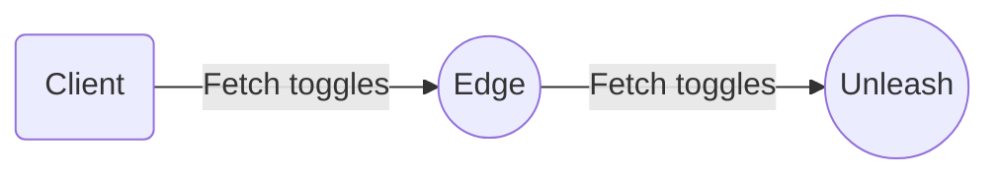
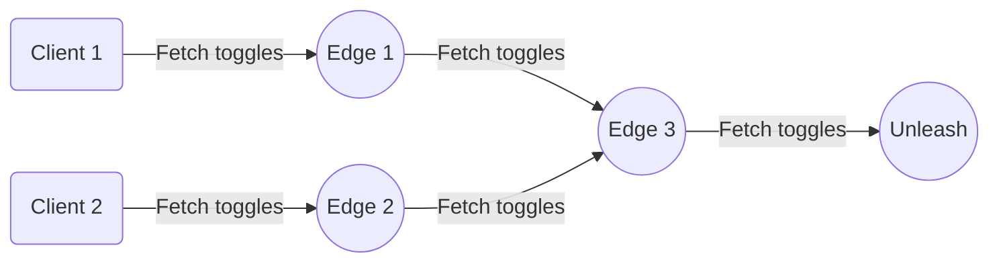
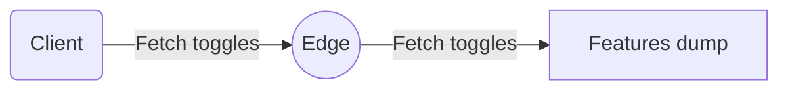

# Concepts

### Modes

Edge currently supports 2 different modes:

- [Edge](#edge) - Connection to upstream node (Unleash instance or another Edge). Supports metrics and
  other advanced features;
- [Offline](#offline) - No connection to upstream node. Full control of data and tokens;

#### Edge



Edge mode is the "standard" mode for Unleash Edge and the one you should default to in most cases. It connects to an
upstream node, such as your Unleash instance, and uses that as the source of truth for feature toggles.

Other than connecting Edge directly to your Unleash instance, it's also possible to connect to another Edge instance (
_daisy chaining_). You can have as many Edge nodes as you'd like between the Edge node your clients are accessing and
the Unleash server, and it's also possible for multiple nodes to connect to a single upstream one. Depending on your
architecture and requirements this can be a powerful feature, offering you flexibility and scalability when planning
your implementation.



This means that, in order to start up, Edge mode needs to know where the upstream node is. This is done by passing
the `--upstream-url` command line argument or setting the `UPSTREAM_URL` environment variable.

By default, Edge mode uses an in-memory cache to store the features it fetches from the upstream node. However, you may
want to use a more persistent storage solution. For this purpose, Edge supports either Redis or a backup file, which you
can configure by passing in either the `--redis-url` or `--backup_folder` command line argument, respectively. On
start-up, Edge checks whether the persistent backup option is specified, in which case it uses it to populate its
internal caches. This can be useful when your Unleash server is unreachable.

Persistent storage is useful for high availability and resilience. If an Edge instance using persistent storage is
restarted, it will not have to synchronize with upstream before it is ready. The persistent storage is only read on
startup and will only be used until Edge is able to synchronize with upstream. Because of this, there is no need to
purge the cache. After Edge has synchronized with an upstream, it will periodically save its in-memory state to the
persistent storage.

Multiple Edge nodes can share the same Redis instance or backup folder. Failure to read from persistent storage will not
prevent Edge from starting up. In this case an Edge instance will be ready only after it is able to connect with
upstream.

### Front-end tokens

[Front-end tokens](https://docs.getunleash.io/reference/api-tokens-and-client-keys#front-end-tokens) can also be used
with `/api/frontend` and `/api/proxy` endpoints, however they are not allowed to fetch features upstream.
In order to use these tokens correctly and make sure they return the correct information, it's important that the
features they are allowed to access are already present in that Edge node's features cache.
The easiest way to ensure this is by passing in at least one client token as one of the command line arguments,
ensuring it has access to the same features as the front-end token you'll be using.
If you're using a frontend token that doesn't have data in the node's feature cache, you will receive an HTTP Status
code: 511 Network Authentication Required along with a body of which project and environment you will need to add a
client token for.

### Starting in edge mode

To see parameters available when running in this mode, run:

```bash
$ unleash-edge edge -h
Run in edge mode

Usage: unleash-edge edge [OPTIONS] --upstream-url <UPSTREAM_URL>

Options:
  -u, --upstream-url <UPSTREAM_URL>
          Where is your upstream URL. Remember, this is the URL to your instance, without any trailing /api suffix [env: UPSTREAM_URL=]
  -r, --redis-url <REDIS_URL>
          A URL pointing to a running Redis instance. Edge will use this instance to persist feature and token data and read this back after restart. Mutually exclusive with the --backup-folder option [env: REDIS_URL=]
  -b, --backup-folder <BACKUP_FOLDER>
          A path to a local folder. Edge will write feature and token data to disk in this folder and read this back after restart. Mutually exclusive with the --redis-url option [env: BACKUP_FOLDER=]
  -m, --metrics-interval-seconds <METRICS_INTERVAL_SECONDS>
          How often should we post metrics upstream? [env: METRICS_INTERVAL_SECONDS=] [default: 60]
  -f, --features-refresh-interval-seconds <FEATURES_REFRESH_INTERVAL_SECONDS>
          How long between each refresh for a token [env: FEATURES_REFRESH_INTERVAL_SECONDS=] [default: 10]
      --token-revalidation-interval-seconds <TOKEN_REVALIDATION_INTERVAL_SECONDS>
          How long between each revalidation of a token [env: TOKEN_REVALIDATION_INTERVAL_SECONDS=] [default: 3600]
  -t, --tokens <TOKENS>
          Get data for these client tokens at startup. Accepts comma-separated list of tokens. Hot starts your feature cache [env: TOKENS=]
  -H, --custom-client-headers <CUSTOM_CLIENT_HEADERS>
          Expects curl header format (-H <HEADERNAME>: <HEADERVALUE>) for instance `-H X-Api-Key: mysecretapikey` [env: CUSTOM_CLIENT_HEADERS=]
  -s, --skip-ssl-verification
          If set to true, we will skip SSL verification when connecting to the upstream Unleash server [env: SKIP_SSL_VERIFICATION=]
      --pkcs8-client-certificate-file <PKCS8_CLIENT_CERTIFICATE_FILE>
          Client certificate chain in PEM encoded X509 format with the leaf certificate first. The certificate chain should contain any intermediate certificates that should be sent to clients to allow them to build a chain to a trusted root [env: PKCS8_CLIENT_CERTIFICATE_FILE=]
      --pkcs8-client-key-file <PKCS8_CLIENT_KEY_FILE>
          Client key is a PEM encoded PKCS#8 formatted private key for the leaf certificate [env: PKCS8_CLIENT_KEY_FILE=]
      --pkcs12-identity-file <PKCS12_IDENTITY_FILE>
          Identity file in pkcs12 format. Typically this file has a pfx extension [env: PKCS12_IDENTITY_FILE=]
      --pkcs12-passphrase <PKCS12_PASSPHRASE>
          Passphrase used to unlock the pkcs12 file [env: PKCS12_PASSPHRASE=]
      --upstream-certificate-file <UPSTREAM_CERTIFICATE_FILE>
          Extra certificate passed to the client for building its trust chain. Needs to be in PEM format (crt or pem extensions usually are) [env: UPSTREAM_CERTIFICATE_FILE=]

  -h, --help
          Print help

```

#### Offline



Offline mode is useful when there is no connection to an upstream node, such as your Unleash instance or another Edge
instance, or as a tool to make working with Unleash easier during development.

To use offline mode, you'll need a features file. The easiest way to get one is to download a JSON dump of a result from
a query against an Unleash server on
the [/api/client/features](https://docs.getunleash.io/reference/api/unleash/get-client-feature) endpoint. You can also
use a hand rolled, human readable JSON version of the features file. Edge will automatically convert it to the API
format when it starts up. Here's an example:

``` json
{
  "featureOne": {
    "enabled": true,
    "variant": "variantOne"
  },
  "featureTwo": {
    "enabled": false,
    "variant": "variantTwo"
  },
  "featureThree": {
    "enabled": true
  }
}
```

The simplified JSON format should be an object with a key for each feature. You can force the result of `is_enabled` in
your SDK by setting the enabled property, likewise can also force the result of `get_variant` by specifying the name of
the variant you want. This format is primarily for development.

When using offline mode you must specify one or more tokens at startup. These tokens will let your SDKs access Edge.
Tokens following the Unleash API format `[project]:[environment].<somesecret>` allow Edge to recognize the project and
environment specified in the token, returning only the relevant features to the calling SDK. On the other hand, for
tokens not adhering to this format, Edge will return all features if there is an exact match with any of the startup
tokens.

To make local development easier, you can specify a reload interval in seconds (Since Unleash-Edge 10.0.x); this will
cause Edge to reload the features file from disk every X seconds. This can be useful for local development.

Since offline mode does not connect to an upstream node, it does not support metrics or other advanced features.

To launch in this mode, run:

```bash
$ ./unleash-edge offline --help
Usage: unleash-edge offline [OPTIONS]

Options:
  -b, --bootstrap-file <BOOTSTRAP_FILE>         [env: BOOTSTRAP_FILE=]
  --client-tokens <TOKENS>                      [env: CLIENT_TOKENS=]
  --frontend-tokens <TOKENS>                    [env: FRONTEND_TOKENS=]
  -r, --reload-interval <RELOAD_INTERVAL>       [env: RELOAD_INTERVAL=]
  --pretrusted-tokens <TOKENS>                  [env: PRETRUSTED_TOKENS=]
```

##### Environments in offline mode

Currently, Edge does not support multiple environments in offline mode. All tokens added at startup will receive the
same list of features passed in as the bootstrap argument.
However, tokens in `<project>:<environment>.<secret>` format will still filter by project.
